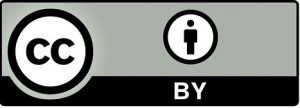

# JosSecurity

## ¿Qué es JosSecurity?

JosSecurity es un versátil framework y librería que se adapta tanto como la base inicial de tu proyecto o como una incorporación dinámica a proyectos existentes. Con herramientas diseñadas para facilitar la creación de sitios web de manera fácil y sencilla, incluso para aquellos sin conocimientos en el desarrollo del back-end.

## ¿Cómo funciona JosSecurity?

JosSecurity opera a través de "jossitos", su sistema de hooks. Cada jossito, una funcionalidad de PHP, se encarga de tareas que van desde consultas básicas hasta operaciones más complejas en la base de datos. Para obtener más información sobre cada "jossito", [consulta la documentación aquí](https://jossecurity.josprox.com/documentation).

## ¿Cuáles son las funciones básicas del sistema?

El sistema ofrece funciones esenciales, como la conexión automática a la base de datos, con las siguientes opciones por defecto:

- Conexión sencilla: `conect_mysqli();`
- Conexión PDO: `conect_mysql();`

También incluye la opción de integrar Recaptcha en formularios con la función `recaptcha();`. Descubre más funciones en el archivo "jossecurity.php" o en el sitio web oficial [jossecurity.josprox.com](https://jossecurity.josprox.com).

## ¿Qué contiene?

Además de las funciones principales, JosSecurity cuenta con la sección "plugins" para integrar cualquier necesidad específica del sistema. Esta flexibilidad distingue a JosSecurity, permitiéndote adaptarlo según tus requerimientos. Tras la instalación, cuenta con un panel de control predeterminado que facilita la modificación del sistema desde un navegador, sin necesidad de abrir un editor de código. Su diseño está construido sobre Bootstrap.

### Usuario por defecto

El sistema incluye un usuario de administración con las siguientes credenciales para un login exitoso:

- Usuario: `joss@int.josprox.com`
- Contraseña: `Andyyyo12?`

## Usos

- Sistema JosSecurity & Wordpress disponible. [¡Haz clic aquí!](https://github.com/josprox/JosSecurity-WordPress)
- Plugin JosSecurity & Wordpress disponible. [¡Haz clic aquí!](https://github.com/josprox/JosSecurity_Plugin)

### Ayúdanos

Si encuentras algún error o tienes sugerencias para mejorar, [visita nuestra página de ayuda](https://jossecurity.josprox.com/help-us/).

### Requisitos mínimos para usar JosSecurity:

- Versión mínima requerida de PHP: 8.2.12
- Espacio requerido para la instalación en disco: 137 MB (se recomienda 200 MB)
- Transferencia de red recomendada del servidor: 1.5 MB

### Instalación desde GitHub:

[Descarga la última versión aquí](https://github.com/josprox/JosSecurity/releases) y sigue las instrucciones en el README de instalación.

### Instalación desde NPM:

También puedes descargar JosSecurity por medio de npm con el siguiente código:

	npm i jossecurity

Sigue las instrucciones de instalación en el README.

### Instalación desde Composer:

También puedes descargar JosSecurity por medio de Composer con el siguiente código:

	composer require josprox/jossecurity

Sigue las instrucciones de instalación en el README.

### Instalación:

Si trabajas en un servidor:

* Crea una base de datos, de preferencia usa un cortejo utf8mb4_unicode_ci.
* accede a tu dominio y al archivo correspondiente "installer.php", ejemplo: ("https://tudominio.com/installer.php").
* Sigue las instrucciones para llevar a cabo la instalación, recuerda completar todos los campos y cumplir con los requisitos mínimos.
* Una vez instalado te saldrá el siguiente mensaje 'Se ha insertado los datos de manera correcta.' y te redireccionará a tu panel con la versión de JosSecurity instalado.

Si trabajas en un localhost (usando de ejemplo xampp):

* Crea una base de datos, de preferencia usa un cortejo utf8mb4_unicode_ci.
* Accede al directorio donde instalaste JosSecurity y ponle un acceso a "installer.php", ejemplo: ("http://localhost/jossecurity/installer.php").
* Sigue las instrucciones para llevar a cabo la instalación, recuerda completar todos los campos y cumplir con los requisitos mínimos.
* Una vez instalado te saldrá el siguiente mensaje 'Se ha insertado los datos de manera correcta.' y te redireccionará al panel del sistema.

### Recomendaciones:

- Usar un servidor privado (VPS).
- Ejecutarse con seguridad usando el protocolo SSL/TLS.
- Se recomienda usar un panel de control para administrar el servidor. [Hestia Control Panel](https://hestiacp.com/) es una opción preferida.
- Para pruebas y mejoras, se recomienda usar XAMPP con PHP 8.2 o superior.

#### Ayuda e información

Obten información de las actualizaciones o ayuda del sistema a través de la página [JosSecurity help](https://social.josprox.com/jossecurity) de Alola social.

#### Donaciones.

Puedes donar a través de [Patreon](https://www.patreon.com/jossestrada), [Mercado Pago](https://mpago.la/2gsWWYW) y [Paypal](http://paypal.me/JOSPROXMX). ¡Tu apoyo es fundamental!

#### Licencia.

JosSecurity es creado por JOSPROX MX/ JOSPROX Internacional.
Licencia: CC BY 4.0.

